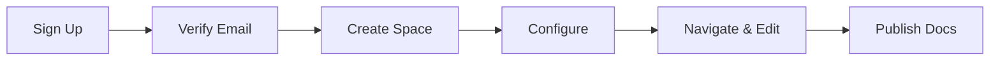

## Overview

Welcome to payal gawade Documentation. Set up your account, configure your space, and navigate your docs in minutes. This guide walks you through the essentials to organize project documentation effectively.

<Columns cols={3}>
  <Card title="Account Setup" icon="user-plus" href="#account-setup">
    Create your account and verify email.
  </Card>
  <Card title="Initial Config" icon="settings" href="#initial-config">
    Customize your documentation space.
  </Card>
  <Card title="Navigation" icon="compass" href="#navigation">
    Explore menus and key features.
  </Card>
</Columns>

## Account Setup

Follow these steps to create and activate your account.

<Steps>
  <Step title="Sign Up" icon="user-plus">
    Visit the sign-up page at `https://payalgawade-docs.com/signup`.

    Fill in your email, name, and password. Use a strong password with at least 12 characters.
  </Step>
  <Step title="Verify Email" icon="mail">
    Check your inbox for the verification email.

    Click the link to confirm your account. It expires in 24 hours.
  </Step>
  <Step title="Create Space" icon="folder-plus">
    Log in and select **New Documentation Space**.

    Name it after your project, like `my-project-docs`.
  </Step>
</Steps>

<Callout kind="tip">
  Enable two-factor authentication (2FA) immediately after setup for added security.
</Callout>

## Initial Configuration

Configure your space with essential settings. Choose your preferred method below.

<Tabs>
  <Tab title="CLI Setup" icon="terminal">
    Install the CLI tool and initialize your space.

    <CodeGroup tabs="npm,yarn">
```bash
npm install -g @payalgawade/docs-cli
payalgawade-docs init my-project-docs
```
```bash
yarn global add @payalgawade/docs-cli
payalgawade-docs init my-project-docs
```
    </CodeGroup>

    Edit the generated `payalgawade.config.js` file:

````javascript
module.exports = {
  title: 'My Project Docs',
  brandColor: '#3B82F6',
  nav: [
    { title: 'Getting Started', href: '/quickstart' },
    { title: 'API Reference', href: '/api' },
  ],
};
````
  </Tab>
  <Tab title="Web Dashboard" icon="monitor">
    Use the browser interface for quick setup.

    1. Go to **Settings > General**.
    2. Set your space title and brand color to `#3B82F6`.
    3. Add navigation items via the UI.

    Preview changes live without code.
  </Tab>
</Tabs>

## Basic Navigation

Master the interface to manage your docs efficiently.

<ExpandableGroup>
  <Expandable title="Sidebar Menu" default-open="true">
    The left sidebar shows your pages hierarchy.

    - **Home**: Landing page.
    - **Pages**: Edit and organize MDX files.
    - **Settings**: Configure space-wide options.

    Drag pages to reorder.
  </Expandable>
  <Expandable title="Search and Preview">
    Use the top search bar to find content quickly.

    Preview mode renders your MDX with components like `<Callout>` and `<Steps>`.
  </Expandable>
</ExpandableGroup>

<Callout kind="info">
  All pages support MDX components. Start with 5-8 types like `Cards`, `Tabs`, and `Steps` for rich docs.
</Callout>

## Next Steps

Your space is ready. Create your first page with `payalgawade-docs new first-page.mdx`. Import components and build structured docs.



Explore advanced features like custom themes and API integrations in the full docs.