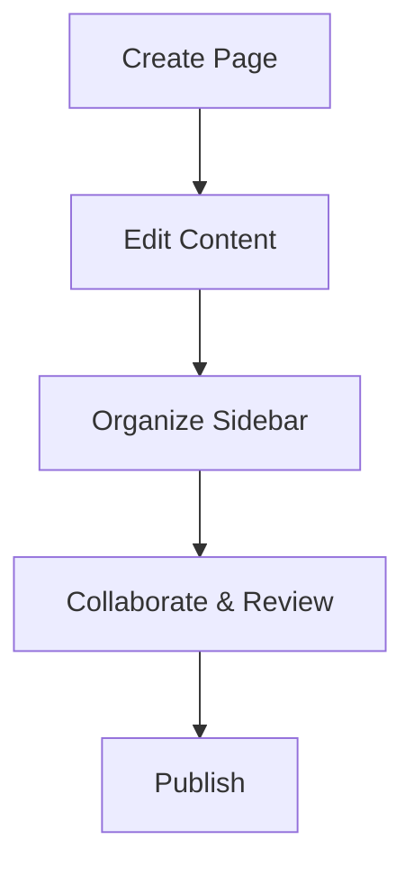

## Overview

Welcome to the payal gawade Documentation user guide. You manage all project documentation here by creating pages, editing content, organizing the sidebar, and collaborating with your team. This space supports MDX for rich, interactive docs with components like Steps and Tabs.

<Columns cols={3}>
  <Card title="Create Pages" icon="file-plus" href="#creating-pages">
    Start new documentation pages quickly.
  </Card>
  <Card title="Edit Content" icon="edit-3" href="#editing-content">
    Update text, code, and components.
  </Card>
  <Card title="Organize" icon="layout" href="#organizing-content">
    Structure your sidebar navigation.
  </Card>
</Columns>

## Creating Pages

Follow these steps to create a new page in your payal gawade Documentation space.

<Steps>
  <Step title="Navigate to Pages" icon="search">
    Click the `Pages` icon in the left sidebar.
  </Step>
  <Step title="Add New Page" icon="plus">
    Select `New Page` and enter a title like `API Reference`.
  </Step>
  <Step title="Choose Template" icon="file-text">
    Pick a template: `Blank MDX`, `API Doc`, or `Guide`.
  </Step>
  <Step title="Save and Publish" icon="save">
    Add frontmatter and content, then click `Publish`.
  </Step>
</Steps>

<Callout kind="tip">
  Use YAML frontmatter for metadata:
  
  ```
  ---
  title: My Page
  description: Page summary
  ---
  ```
</Callout>

## Editing Content

Edit pages visually or in code. Switch between editors based on your needs.

<Tabs>
  <Tab title="Visual Editor" icon="mouse-pointer">
    Drag-and-drop components like `<Callout>` or `<Steps>`. Preview changes live.
    
    <Image
      src="https://example.com/visual-editor.png"
      alt="Visual editor interface showing drag-and-drop components"
      width="800"
      height="500"
    />
  </Tab>
  <Tab title="Code Editor" icon="code">
    Write raw MDX. Supports syntax highlighting for `javascript`, `python`, and more.
    
    <CodeGroup tabs="MDX,JavaScript">
      ```mdx
      ## Hello World
      
      <Callout kind="info">
        This is interactive content.
      </Callout>
      ```
      ```javascript
      console.log('Documentation ready');
      
      export function renderDoc() {
        return <div>Dynamic content</div>;
      }
      ```
    </CodeGroup>
  </Tab>
</Tabs>

## Organizing Content

Structure your documentation with a nested sidebar. Drag pages to reorder or nest them.

| Action | Steps | Example |
|--------|-------|---------|
| Reorder Pages | Drag in sidebar | Move `User Guide` above `API` |
| Create Folders | Right-click > `New Folder` | `/guides/user-guide.mdx` |
| Set Homepage | Pages > `Set as Home` | `index.mdx` |

<Expandable title="Advanced Organization" default-open="false">
  Use `slug` in frontmatter for custom URLs:
  
  ```
  ---
  title: Custom Page
  slug: my-custom-path
  ---
  ```
  
  This creates `/docs/my-custom-path`.
</Expandable>

## Collaboration Features

Invite team members and review changes together.

<Steps>
  <Step title="Invite Collaborators" icon="users">
    Go to `Settings` > `Members` > `Invite by email`.
  </Step>
  <Step title="Review Changes" icon="git-pull-request">
    Enable `Pull Requests` in settings. Create PRs for edits.
  </Step>
  <Step title="Comments" icon="message-circle">
    Highlight text on any page and add comments.
  </Step>
  <Step title="Version History" icon="git-branch">
    View `History` tab to revert changes.
  </Step>
</Steps>

<Callout kind="success">
  All changes are versioned automatically. No lost work.
</Callout>



Your payal gawade Documentation space is now ready for production use. Explore advanced features like custom themes in `Settings` > `Branding`.